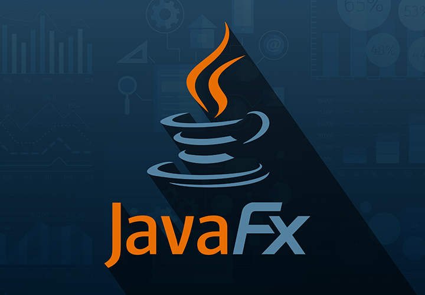

<a name="readme-top"></a>

<!-- PROJECT SHIELDS -->
<h1 align="center">

[contributors-shield]: https://img.shields.io/github/contributors/YOUR_USERNAME/YOUR_REPO_NAME.svg?style=for-the-badge
[contributors-url]: https://github.com/YOUR_USERNAME/YOUR_REPO_NAME/graphs/contributors

[forks-shield]: https://img.shields.io/github/forks/YOUR_USERNAME/YOUR_REPO_NAME.svg?style=for-the-badge&logo=github
[forks-url]: https://github.com/YOUR_USERNAME/YOUR_REPO_NAME/network/members

[stars-shield]: https://img.shields.io/github/stars/YOUR_USERNAME/YOUR_REPO_NAME.svg?style=for-the-badge&logo=github
[stars-url]: https://github.com/YOUR_USERNAME/YOUR_REPO_NAME/stargazers

[issues-shield]: https://img.shields.io/github/issues/YOUR_USERNAME/YOUR_REPO_NAME.svg?style=for-the-badge
[issues-url]: https://github.com/YOUR_USERNAME/YOUR_REPO_NAME/issues

[license-shield]: https://img.shields.io/github/license/YOUR_USERNAME/YOUR_REPO_NAME.svg?style=for-the-badge
[license-url]: https://github.com/YOUR_USERNAME/YOUR_REPO_NAME/blob/master/LICENSE.txt

[linkedin-shield]: https://img.shields.io/badge/-LinkedIn-black.svg?style=for-the-badge&logo=linkedin&colorB=555
[linkedin-url]: https://linkedin.com/in/YOUR_LINKEDIN_PROFILE

</h1 >
<!-- PROJECT LOGO -->
<br />
<div align="center">
  <a href="https://github.com/Nityananda-Krishnamoorthy/javafx-quickstart-macos-arm">
    
  </a>

<h3 align="center">JavaFX Quickstart — macOS ARM (Java 21)</h3>

  <p align="center">
    A fully configured JavaFX 21 + Maven starter template optimized for macOS ARM (M1/M2/M3/M4).
    <br />
    <a href="https://github.com/Nityananda-Krishnamoorthy/javafx-quickstart-macos-arm"><strong>Explore the docs »</strong></a>
    <br />
    <br />
    <a href="https://github.com/Nityananda-Krishnamoorthy/javafx-quickstart-macos-arm">View Demo</a>
    ·
    <a href="https://github.com/Nityananda-Krishnamoorthy/javafx-quickstart-macos-arm/issues">Report Bug</a>
    ·
    <a href="https://github.com/Nityananda-Krishnamoorthy/javafx-quickstart-macos-arm/issues">Request Feature</a>
  </p>
</div>

---

<!-- TABLE OF CONTENTS -->
<details>
  <summary>Table of Contents</summary>
  <ol>
    <li><a href="#about-the-project">About The Project</a></li>
    <li><a href="#project-structure">Project Structure</a></li>
    <li>
      <a href="#getting-started">Getting Started</a>
      <ul>
        <li><a href="#prerequisites">Prerequisites</a></li>
        <li><a href="#installation">Installation</a></li>
      </ul>
    </li>
    <li><a href="#Create Your Own Project (Detach From Template)">Create Your Own Project (Detach From Template)</a></li>
    <li><a href="#usage">Usage</a></li>
    <li><a href="#roadmap">Roadmap</a></li>
    <li><a href="#Owner Information">License</a></li>
  </ol>
</details>

---

## About The Project

<!-- [![Product Screenshot][product-screenshot]](https://example.com) -->

This repository provides a clean, ready-to-run template for building **JavaFX 21 applications** using **Maven** on **macOS ARM** processors (Apple Silicon). It eliminates all environment problems such as:

- Incorrect JavaFX classifiers  
- Missing modules  
- Wrong Java version  
- IDE misconfiguration  

This project is ideal for:

- Students learning JavaFX  
- New developers building desktop GUI apps  
- Anyone who wants a perfect zero-setup JavaFX starter template  

---

## Project Structure

```swift
javafx-quickstart-macos-arm/
│── pom.xml
│── src/
│   └── main/
│       ├── java/
│       │   └── com/example/app/
│       │       ├── App.java
│       │       └── Controller.java
│       └── resources/
│           └── com/example/app/
│               └── view.fxml
```
---

## Getting Started

### Prerequisites

Install Java 21 (Homebrew):

```sh
brew install openjdk@21
```

Set PATH:

```sh
echo 'export PATH="/opt/homebrew/opt/openjdk@21/bin:$PATH"' >> ~/.zshrc
source ~/.zshrc
```

Install Maven:

```sh
brew install maven
```

Verify:

```sh
java -version
mvn -v
```

### Installation

Clone the repository:

```sh
git clone https://github.com/Nityananda-Krishnamoorthy/javafx-quickstart-macos-arm.git
cd javafx-quickstart-macos-arm
```

Build:

```sh
mvn clean install
```
Run the JavaFX application:

```sh
mvn clean javafx:run
```

## Create Your Own Project (Detach From Template)

### If you want to use this starter to create your own project, follow these steps:

Step A — Remove the link to the original repository

```sh
git remote remove origin
```

Step B — Create a new empty GitHub repository

```swift
(Do not add README, .gitignore, or license on GitHub.)
```

Step C — Connect your local folder to your new repository

```sh
git remote add origin https://github.com/<your-username>/<your-new-repo>.git
git branch -M main
git push -u origin main
```
Now the quick-starter is fully yours.

## Usage

This starter project includes:

- A JavaFX Application class (App.java)
- An FXML UI (view.fxml)
- A controller (Controller.java)
- Maven configured with correct JavaFX dependencies
- Java 21 and macOS ARM support via classifiers

Modify UI:

```swift
src/main/resources/com/example/app/view.fxml
```
Modify logic:

```swift
src/main/java/com/example/app/Controller.java
```
Add more JavaFX modules in pom.xml if needed:

```xml
<dependency>
    <groupId>org.openjfx</groupId>
    <artifactId>javafx-graphics</artifactId>
    <version>${javafx.version}</version>
    <classifier>mac-aarch64</classifier>
</dependency>
```
## Roadmap

 - [x] Fully working JavaFX 21 starter
 - [x] macOS ARM auto-configuration
 - [x] Maven JavaFX plugin setup
 - [ ] Include advanced JavaFX components (TableView, Charts, etc.)
 - [ ] Add dark/light theme
 - [ ] Add sample multi-page navigation
 - [ ] Add unit tests (JUnit 5)

## Owner Information

Author: Nityananda Krishnamoorthy
GitHub: github.com/Nityananda-Krishnamoorthy
Contact: contactmenitish06@gmail.com
